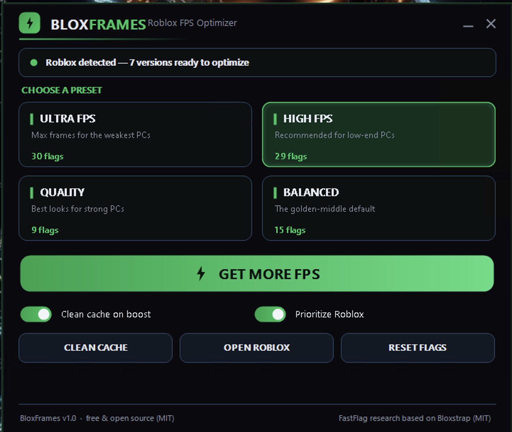

# BloxFrames — Increase FPS in Roblox (free performance optimizer for Windows)

**A free, lightweight Windows tool to increase Roblox FPS.** Pick a preset, hit **Get More FPS**, launch Roblox — done.

If you have been searching for **how to get more fps in roblox**, BloxFrames is the simple answer: it tunes Roblox's own FastFlags, clears the cache and prioritizes the game, all from one small Windows installer (`.msi`). No ads, no telemetry. Built to give you **more fps in roblox** on everything from a potato laptop to a high-end rig.

## Why BloxFrames

Roblox runs on the same graphics engine for everyone, but its default settings leave frames on the table — especially on low-end PCs. BloxFrames applies a curated **FastFlag** preset that uncaps the framerate and trims the expensive visual effects, so you get smoother, higher FPS without editing any config files by hand.

- **One click to more FPS** — apply a full performance preset to every installed Roblox version at once.
- **Four presets, low-end first** — **Ultra FPS**, **High FPS**, **Quality** and **Balanced**, tuned from potato laptops up to strong rigs.
- **Uncapped framerate** — lifts Roblox's default 60-frame limit (up to 144 / 240 / 360 / unlimited depending on preset) via the standard TaskScheduler target-FPS flag.
- **Smart render backend** — Vulkan for maximum frames, stable Direct3D11 for the quality tiers, with D3D11 always kept as a safe fallback.
- **Tiered lighting** — legacy Voxel for raw speed, ShadowMap for the balanced default, full Future lighting for the best looks.
- **Deep low-end controls** — turn off MSAA, post-processing, shadows, terrain grass and composited textures to reclaim frames.
- **Cache cleaner** — clears Roblox logs / temp / cached assets and reports how many MB it freed.
- **Prioritize Roblox** — sets the running game to High priority across all CPU cores for steadier frame pacing.
- **Fully reversible** — Reset removes every flag BloxFrames added and leaves your own settings untouched.
- **Simple install** — a small `.msi` package, runs on Windows 10/11 (.NET Framework 4.8, preinstalled).

## How it works

BloxFrames writes Roblox's own `ClientAppSettings.json` (in each `Versions\<ver>\ClientSettings` folder) — **the exact same mechanism Bloxstrap and every community FastFlag pack use**. Every value ships only after being cross-checked against the [Bloxstrap](https://github.com/bloxstraplabs/bloxstrap) FastFlag manager and the wider Roblox FastFlag community. Nothing is injected into the game and nothing touches Roblox's memory — BloxFrames only edits the settings file Roblox already reads on startup.

## Download

1. Download `BloxFrames.zip`
2. Unzip it anywhere
3. Run `BloxFrames.msi` and follow the installer

## Quick start — how to get more fps in roblox

1. **Pick a preset** — start with **High FPS** (recommended for low-end PCs) or **Ultra FPS** for the absolute maximum.
2. **Hit `⚡ GET MORE FPS`** — flags are applied, cache cleaned, Roblox prioritized.
3. **Launch Roblox** and enjoy the extra frames. Changed your mind? Press **Reset Flags**.

## Presets at a glance

| Preset | Best for | FPS cap | Lighting | Look |
|---|---|---|---|---|
| 🟢 **Ultra FPS** | potato / very low-end | unlimited | Voxel | bare-bones, max frames |
| 🟢 **High FPS** | low-end (recommended) | 360 | Voxel | playable, big FPS gain |
| 🟢 **Balanced** | everyday default | 144 | ShadowMap | smooth + still pretty |
| 🟢 **Quality** | strong PCs | 240 | Future | best looks |

## Safety & transparency

- **No ads, no bundles, no telemetry.** Just the optimizer.
- **Open source (MIT).** Every line is public. FastFlag research is based on **Bloxstrap by pizzaboxer (MIT)** and the Roblox FastFlag community.
- **Reversible.** BloxFrames only edits Roblox's own `ClientAppSettings.json`. Reset undoes it instantly, and unknown/renamed flags are skipped rather than forced.
- **SmartScreen note:** the app is unsigned, so Windows may show an "unknown publisher" prompt — click *More info → Run anyway*. Nothing is hidden inside.
- **Not affiliated with or endorsed by Roblox Corporation.** "Roblox" is a trademark of Roblox Corporation.

## Credits

Based on **[Bloxstrap](https://github.com/bloxstraplabs/bloxstrap) by pizzaboxer**, MIT License, and the wider Roblox FastFlag community. See [`LICENSE`](LICENSE).

## License

MIT — see [`LICENSE`](LICENSE).
