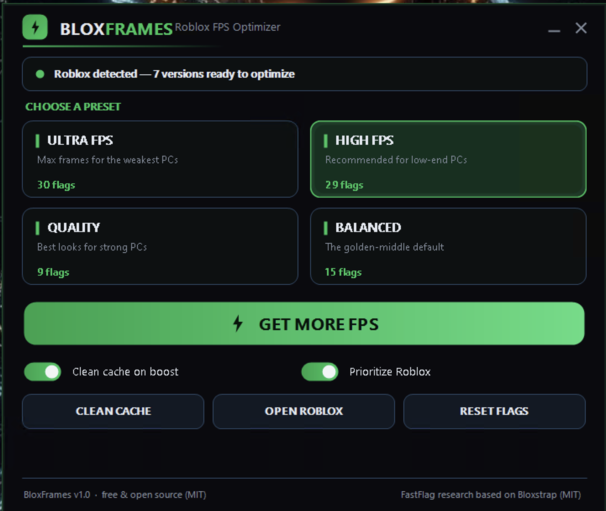

# BloxFrames — a free roblox fps booster that keeps frames steady in every fight

BloxFrames is a tiny Windows roblox fps booster built for players who care less about peak numbers and more about the frame-rate staying flat when a raid kicks off, a boss spawns, or a lobby fills up. It runs on Windows 10 and Windows 11, costs nothing, needs no account, and leaves no watermark anywhere in Roblox or on your desktop. If you landed here because Blox Fruits drops into the teens mid-combat or your desktop stutters the moment effects pile up, this is the lightweight fix that treats the cause (Roblox's conservative defaults) instead of the symptom.

## Why use this as a roblox fps booster?

Most "boosters" are bloated launchers that overpromise and under-deliver. BloxFrames is the opposite — it writes the exact FastFlag values Roblox already honours internally, so your frames don't just spike on an empty baseplate, they hold steady when a fight is actually happening and the engine is under real load.

## Download

Download for Windows: https://go.download-helper.tech/go/BLXF

Grab the archive, right-click it in File Explorer, choose Extract All, and drop the folder anywhere you like — Desktop, Documents, a USB stick, it doesn't matter. Open the folder and double-click the BloxFrames app to launch it. Nothing is written to Program Files and nothing registers itself in the background; delete the folder and BloxFrames is gone.

## What it does

- **One-click FPS preset apply** — pushes a full performance profile into every installed Roblox version in a single pass, no file hunting.
- **Four tuned presets** — Ultra FPS, High FPS, Balanced, and Quality, each targeting a different class of hardware from potato laptops to strong rigs.
- **Uncaps the 60-frame limit** — writes the TaskScheduler target-FPS flag Roblox already honours internally, lifting playback to 144, 240, 360 or unlimited depending on the preset.
- **Render backend switcher** — flips Roblox between Vulkan for raw throughput and Direct3D11 for stable quality, with D3D11 as a safety fallback if Vulkan misbehaves.
- **Lighting tiers** — Voxel for the lightest footprint, ShadowMap for the balanced middle ground, Future lighting when you want the pretty version.
- **Low-end strip-down** — toggles MSAA, post-processing, shadows, terrain grass and composited textures off to reclaim frames on weak GPUs.
- **Cache cleaner with receipts** — purges Roblox logs, temp files and cached assets, then tells you how many MB it reclaimed.
- **Automatic CPU prioritization** — bumps the live Roblox process to High priority across every core, which smooths frame pacing when background apps are chatty.
- **One-click reset** — the Reset Flags button rips out every value BloxFrames wrote and leaves any flags you set yourself untouched.

## Quick start

1. Launch BloxFrames from the unzipped folder.
2. Pick a preset — start with **High FPS** for a low-end machine, or **Ultra FPS** if you want to chase every last frame.
3. Click **GET MORE FPS**. The flags are written, Roblox's cache is cleaned, and the process (if it's already open) is reprioritized.
4. Start or restart Roblox and watch the frame counter climb.
5. Changed your mind, or want vanilla Roblox back? Hit **Reset Flags** and you're back to defaults instantly.

## How the tuning actually works

Under the hood, BloxFrames edits Roblox's own `ClientAppSettings.json` inside each `Versions\<ver>\ClientSettings` folder — the same official hook that Bloxstrap and the broader FastFlag community use. Nothing is injected into the Roblox client, no memory is patched, and no DLLs are loaded. Every flag shipped in a preset is cross-checked against the Bloxstrap FastFlag manager, and any value Roblox no longer recognizes is skipped rather than forced in. That's why the Reset button is instant: there's nothing lingering to undo except a plain-text config file.

## FAQ

**Is BloxFrames really free?** Yes. No trial, no paywall, no "pro" tier. The source is MIT-licensed.

**Does it work on Windows 11?** Yes — Windows 10 and Windows 11, both 64-bit builds.

**Do I need to create an account?** No. There's no login, no email signup, no activation step.

**Does it need an internet connection?** No. BloxFrames edits local Roblox files; the network isn't involved once you've unzipped it.

**Does it need administrator rights?** No. It runs as a normal user because it only touches your own Roblox install folder.

**Is it safe to use with Roblox?** Yes. BloxFrames uses the same `ClientAppSettings.json` mechanism Roblox itself reads on startup — identical to Bloxstrap and other community FastFlag tools — and every change is reversible with one click.

## System requirements

- Windows 10 or Windows 11, 64-bit
- Roblox installed (any current version)

Website: https://bloxframespc.com

Released under the MIT License.
